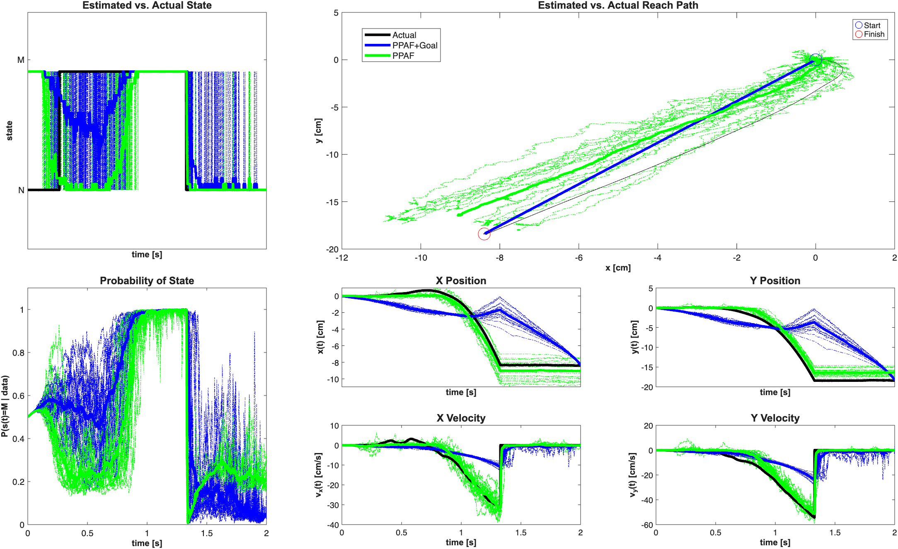

nSTAT
=====

Neural Spike Train Analysis Toolbox for Matlab


nSTAT is an open-source, object-oriented Matlab toolbox that implements a range of models and algorithms for neural spike train data analysis. Such data are frequently obtained from neuroscience experiments and our intention in writing nSTAT is to facilitate quick, easy and consistent neural data analysis.

One of nSTAT's key strengths is point process generalized linear models for spike train signals that provide a formal statistical framework for processing signals recorded from ensembles of single neurons. It also has extensive support for model fitting, model order analysis, and adaptive decoding. In addition to point process algorithms, nSTAT also provides tools for Gaussian signals, ranging from correlation analysis to the Kalman filter, which can be applied to continuous normally-distributed neural signals such as local field potentials, EEG, ECoG, etc.

Although created with neural signal processing in mind, nSTAT can be used as a generic tool for analyzing any types of discrete and continuous signals, and thus has wide applicability.

Like all open-source projects, nSTAT will benefit from your involvement, suggestions and contributions. This platform is intended as a repository for extensions to the toolbox based on your code contributions as well as for flagging and tracking open issues.

The current release version of nSTAT can be downloaded from https://www.neurostat.mit.edu/nstat .
Lab websites:
- Neuroscience Statistics Research Laboratory: https://www.neurostat.mit.edu
- RESToRe Lab: https://www.med.upenn.edu/cajigaslab/

How to install nSTAT
--------------------

1. Clone this repository and open MATLAB.
2. Change directory to the repository root (the folder containing `nSTAT_Install.m`).
3. Run the installer:

```matlab
nSTAT_Install
```

Optional installer flags:

```matlab
nSTAT_Install('RebuildDocSearch', true, 'CleanUserPathPrefs', false)
```

- `RebuildDocSearch` rebuilds the help search database in `helpfiles/`.
- `CleanUserPathPrefs` removes stale user MATLAB path entries.

Quickstart (MATLAB 2025b):

```matlab
cd('/path/to/nSTAT')
nSTAT_Install('RebuildDocSearch',true,'CleanUserPathPrefs',true);
addpath(fullfile(pwd,'tools'));
run_all_checks('GenerateBaseline',false,'CheckParity',true,'RunTests',true,'PublishDocs',false,'Style','legacy');
```

Reproduce paper examples and export generated figures:

```matlab
addpath(fullfile(pwd,'tools'));

% Default docs style (readability-focused)
publish_examples('Style','modern');

% Strict visual reproduction mode
publish_examples('Style','legacy');
```

Outputs are generated under `docs/figures/` and are created from repository
code only (no publication PDF image embedding).

Example generated output (modern style):



Rendered help documentation (GitHub Pages):
- https://cajigaslab.github.io/nSTAT/

For mathematical and programmatic details of the toolbox, see:

Cajigas I, Malik WQ, Brown EN. nSTAT: Open-source neural spike train analysis toolbox for Matlab. Journal of Neuroscience Methods 211: 245–264, Nov. 2012
http://doi.org/10.1016/j.jneumeth.2012.08.009
PMID: 22981419

Paper-aligned toolbox map
-------------------------

To keep terminology and workflows consistent with the 2012 toolbox paper,
the MATLAB help system includes a dedicated mapping page:

- `helpfiles/PaperOverview.m` (published as `PaperOverview.html`)

This page ties major toolbox components to the paper's workflow categories:

- Class hierarchy and object model (`SignalObj`, `Covariate`, `Trial`,
  `Analysis`, `FitResult`, `DecodingAlgorithms`)
- Fitting and assessment workflow (GLM fitting, diagnostics, summaries)
- Simulation workflow (conditional intensity and thinning examples)
- Decoding workflow (univariate/bivariate and history-aware decoding)
- Example-to-paper section mapping via `nSTATPaperExamples`

If you use nSTAT in your work, please remember to cite the above paper in any publications.
nSTAT is protected by the GPL v2 Open Source License.

The code repository for nSTAT is hosted on GitHub at https://github.com/cajigaslab/nSTAT.
You can download the example data file from the paper at: https://doi.org/10.6084/m9.figshare.4834640

Python port
-----------

The standalone Python port now lives in a separate repository:

- https://github.com/cajigaslab/nSTAT-python

This `nSTAT` repository is MATLAB-focused and retains:

- Original MATLAB class/source files
- MATLAB helpfiles and help index (`helpfiles/helptoc.xml`)
- MATLAB example workflows, including `.mlx` examples
