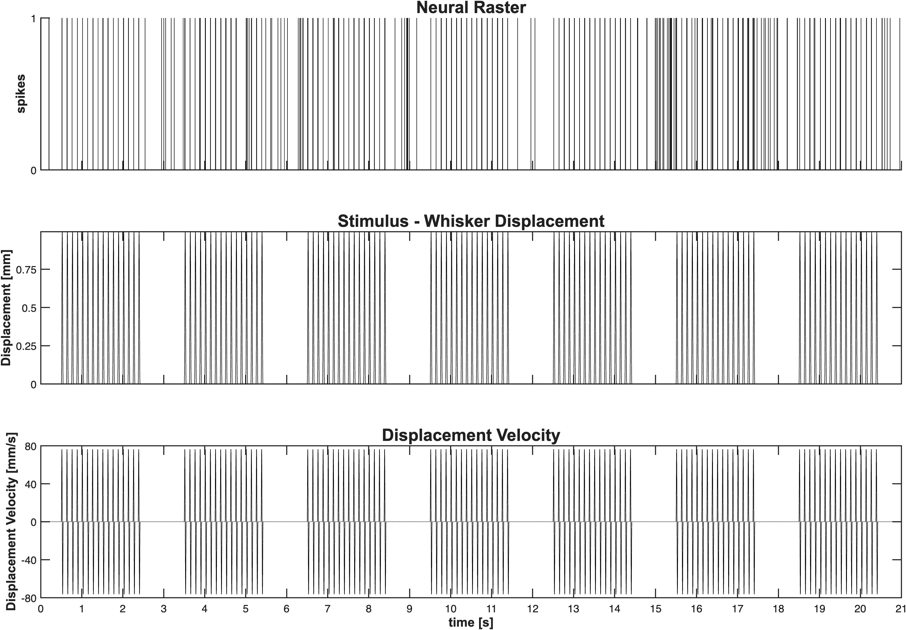
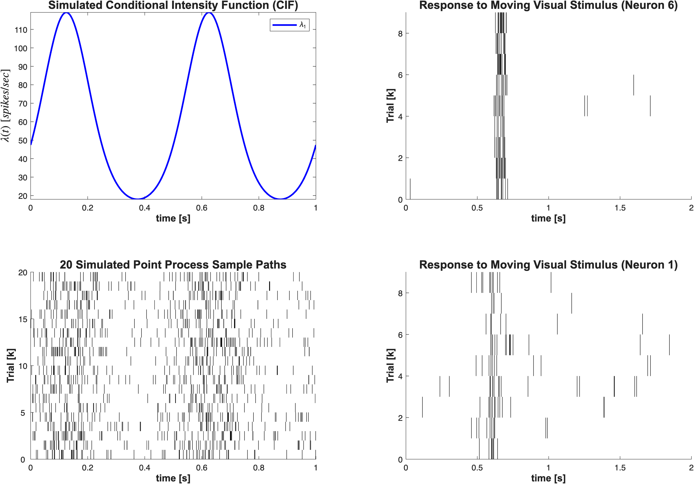
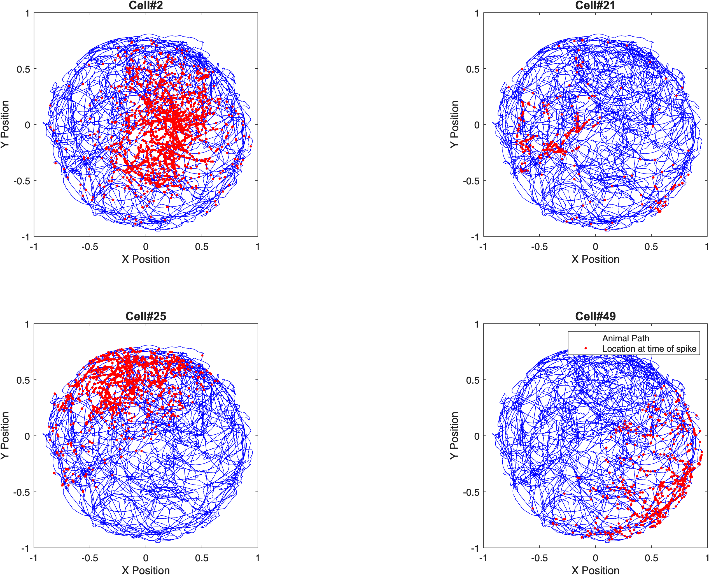
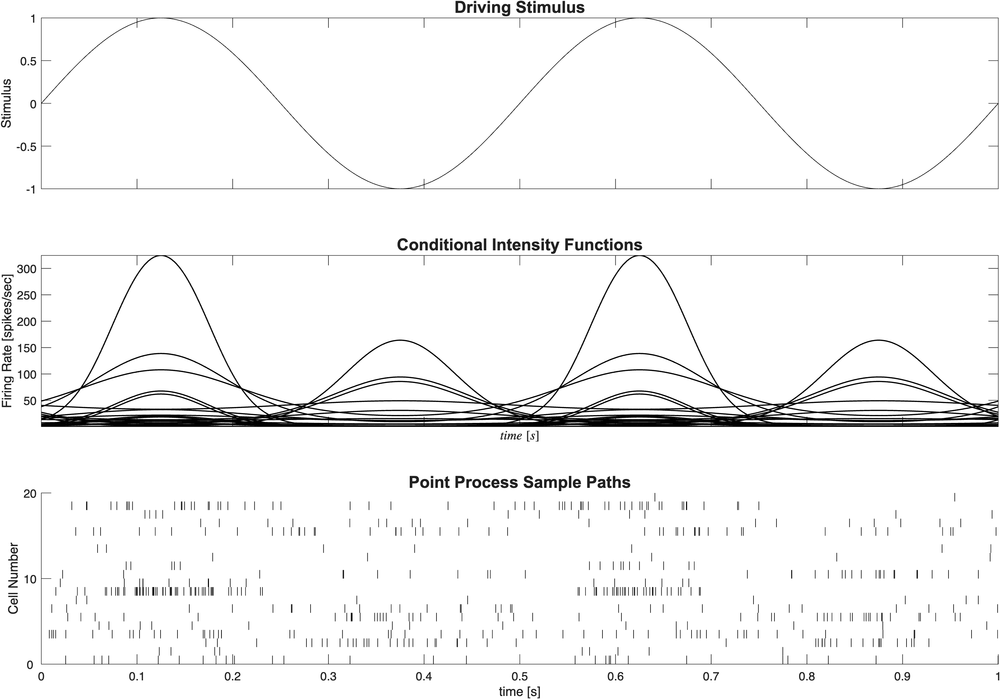

nSTAT
=====

Neural Spike Train Analysis Toolbox for Matlab


nSTAT is an open-source, object-oriented Matlab toolbox that implements a range of models and algorithms for neural spike train data analysis. Such data are frequently obtained from neuroscience experiments and our intention in writing nSTAT is to facilitate quick, easy and consistent neural data analysis.

One of nSTAT's key strengths is point process generalized linear models for spike train signals that provide a formal statistical framework for processing signals recorded from ensembles of single neurons. It also has extensive support for model fitting, model order analysis, and adaptive decoding. In addition to point process algorithms, nSTAT also provides tools for Gaussian signals, ranging from correlation analysis to the Kalman filter, which can be applied to continuous normally-distributed neural signals such as local field potentials, EEG, ECoG, etc.

Although created with neural signal processing in mind, nSTAT can be used as a generic tool for analyzing any types of discrete and continuous signals, and thus has wide applicability.

Like all open-source projects, nSTAT will benefit from your involvement, suggestions and contributions. This platform is intended as a repository for extensions to the toolbox based on your code contributions as well as for flagging and tracking open issues.

The current release version of nSTAT can be downloaded from https://github.com/cajigaslab/nSTAT/ .
Lab websites:
- Neuroscience Statistics Research Laboratory: https://www.neurostat.mit.edu
- RESToRe Lab: https://www.med.upenn.edu/cajigaslab/

How to install nSTAT
--------------------

1. Clone this repository and open MATLAB.
2. Change directory to the repository root (the folder containing `nSTAT_Install.m`).
3. Run the installer:

```matlab
nSTAT_Install
```

When the paper-example dataset is not present, the installer now prompts to
download it from figshare into the repository `data/` folder.

Noninteractive install:

```matlab
nSTAT_Install('DownloadExampleData',true)
```

Optional installer flags:

```matlab
nSTAT_Install('RebuildDocSearch', true, 'CleanUserPathPrefs', false, 'DownloadExampleData', 'prompt')
```

- `RebuildDocSearch` rebuilds the help search database in `helpfiles/`.
- `CleanUserPathPrefs` removes stale user MATLAB path entries.
- `DownloadExampleData` accepts `true`/`'always'`, `false`/`'never'`, or `'prompt'`.

Quickstart (MATLAB 2025b):

```matlab
cd('/path/to/nSTAT')
nSTAT_Install('RebuildDocSearch',true,'CleanUserPathPrefs',true);
addpath(fullfile(pwd,'tools'));
run_all_checks('GenerateBaseline',false,'CheckParity',true,'RunTests',true,'PublishDocs',false,'Style','legacy');
```

Paper Examples (Self-Contained)
-------------------------------

Canonical source files:
- `helpfiles/nSTATPaperExamples.mlx` (preferred narrative source)
- `helpfiles/nSTATPaperExamples.m` (script source used for extraction)

Single command to regenerate every standalone paper example and figure:

```matlab
cd('/path/to/nSTAT')
addpath(genpath(pwd));
build_paper_examples;
```

This produces `docs/figures/<example_id>/...` and
`docs/figures/manifest.json`. All images are generated from MATLAB code in
this repository; no figures are copied from the publication PDF.

| Example | Thumbnail | What question it answers | Run command | Links |
|---|---|---|---|---|
| Example 01 |  | Do mEPSCs follow constant vs piecewise Poisson firing under Mg2+ washout? | `example01_mepsc_poisson('ExportFigures',true,'ExportDir',fullfile(pwd,'docs','figures','example01'));` | [Script](examples/paper/example01_mepsc_poisson.m) · [Figures](docs/figures/example01/) |
| Example 02 |  | How do explicit whisker stimulus and spike history improve thalamic GLM fits? | `example02_whisker_stimulus_thalamus('ExportFigures',true,'ExportDir',fullfile(pwd,'docs','figures','example02'));` | [Script](examples/paper/example02_whisker_stimulus_thalamus.m) · [Figures](docs/figures/example02/) |
| Example 03 |  | How do PSTH and SSGLM capture within-trial and across-trial dynamics? | `example03_psth_and_ssglm('ExportFigures',true,'ExportDir',fullfile(pwd,'docs','figures','example03'));` | [Script](examples/paper/example03_psth_and_ssglm.m) · [Figures](docs/figures/example03/) |
| Example 04 |  | Which receptive-field basis (Gaussian vs Zernike) better fits place cells? | `example04_place_cells_continuous_stimulus('ExportFigures',true,'ExportDir',fullfile(pwd,'docs','figures','example04'));` | [Script](examples/paper/example04_place_cells_continuous_stimulus.m) · [Figures](docs/figures/example04/) |
| Example 05 |  | How well do adaptive/hybrid point-process filters decode stimulus and reach state? | `example05_decoding_ppaf_pphf('ExportFigures',true,'ExportDir',fullfile(pwd,'docs','figures','example05'));` | [Script](examples/paper/example05_decoding_ppaf_pphf.m) · [Figures](docs/figures/example05/) |

Expanded paper-example index and figure gallery:
- [docs/paper_examples.md](docs/paper_examples.md)

Plot style policy:

```matlab
% Modern readability-focused plots (default)
nstat.setPlotStyle('modern');

% Legacy visual style for strict reproduction
nstat.setPlotStyle('legacy');
```
Rendered help documentation (GitHub Pages):
- https://cajigaslab.github.io/nSTAT/

For mathematical and programmatic details of the toolbox, see:

Cajigas I, Malik WQ, Brown EN. nSTAT: Open-source neural spike train analysis toolbox for Matlab. Journal of Neuroscience Methods 211: 245–264, Nov. 2012
https://doi.org/10.1016/j.jneumeth.2012.08.009
PMID: 22981419

Paper-aligned toolbox map
-------------------------

To keep terminology and workflows consistent with the 2012 toolbox paper,
the MATLAB help system includes a dedicated mapping page:

- `helpfiles/PaperOverview.m` (published as `PaperOverview.html`)

This page ties major toolbox components to the paper's workflow categories:

- Class hierarchy and object model (`SignalObj`, `Covariate`, `Trial`,
  `Analysis`, `FitResult`, `DecodingAlgorithms`)
- Fitting and assessment workflow (GLM fitting, diagnostics, summaries)
- Simulation workflow (conditional intensity and thinning examples)
- Decoding workflow (univariate/bivariate and history-aware decoding)
- Example-to-paper section mapping via `nSTATPaperExamples`

If you use nSTAT in your work, please remember to cite the above paper in any publications.
nSTAT is protected by the GPL v2 Open Source License.

The code repository for nSTAT is hosted on GitHub at https://github.com/cajigaslab/nSTAT.
The paper-example dataset is distributed separately from the Git repository:
- Figshare dataset DOI: https://doi.org/10.6084/m9.figshare.4834640.v3
- Paper DOI: https://doi.org/10.1016/j.jneumeth.2012.08.009

Code audit (2026-03-10)
-----------------------

A comprehensive 5-phase code audit identified and fixed 67 bugs across 8
core files. All changes are tagged with inline `% FIX:` comments for easy
review. See [AUDIT_REPORT.md](AUDIT_REPORT.md) for full details.

**Critical bugs fixed:**

- **FitResult.m** — Time-rescaling KS test used `sampleRate` as bin width
  instead of `1/sampleRate`, invalidating goodness-of-fit for any
  sampleRate != 1
- **DecodingAlgorithms.m** — `isa(condNum,'nan')` always returned false,
  so NaN condition numbers were never caught and singular matrices passed
  unchecked through PPAF/PPHF decoding; `ExplambdaDeltaCubed` used `.^2`
  instead of `.^3`, corrupting higher-order filter corrections
- **CIF.m** — `symvar()` reordered variables alphabetically, but all
  callers passed arguments in `varIn` order, causing silent argument
  mismatch in `matlabFunction`-generated handles for non-alphabetical
  variable names
- **SignalObj.m** — `findPeaks('minima')` silently returned maxima;
  `findGlobalPeak('minima')` always crashed due to `sOBj` typo; handle
  aliasing in `times`/`rdivide`/`ldivide` mutated input signals
- **nspikeTrain.m** — Burst detection had off-by-one index error and
  wrong append order

**Code quality improvements:**

- 22 `eval()` → `feval()` conversions (SignalObj.m)
- 11 silent `catch` → named exception captures
- 7 `roundn` → `round` replacements (removes Mapping Toolbox dependency)
- 3 `log(0)` guards, division-by-zero guards, floating-point index fixes
- `fitType` validation in CIF constructor
- Deprecated function annotations (`histc`, `simget`)

Python port
-----------

The standalone Python port now lives in a separate repository:

- https://github.com/cajigaslab/nSTAT-python

This `nSTAT` repository is MATLAB-focused and retains:

- Original MATLAB class/source files
- MATLAB helpfiles and help index (`helpfiles/helptoc.xml`)
- MATLAB example workflows, including `.mlx` examples
