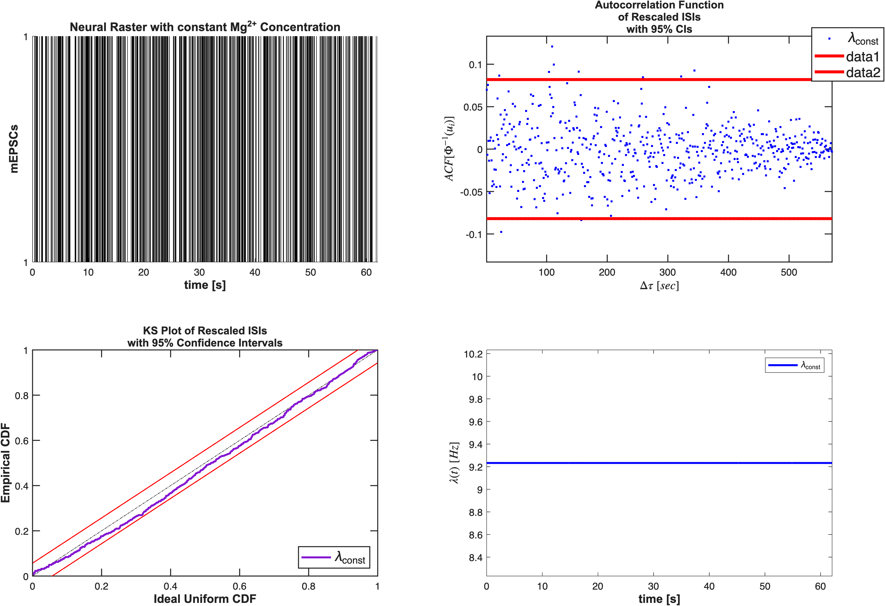
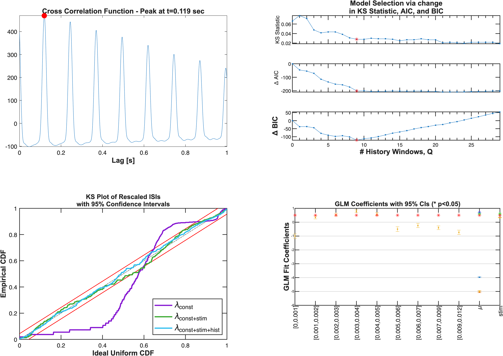
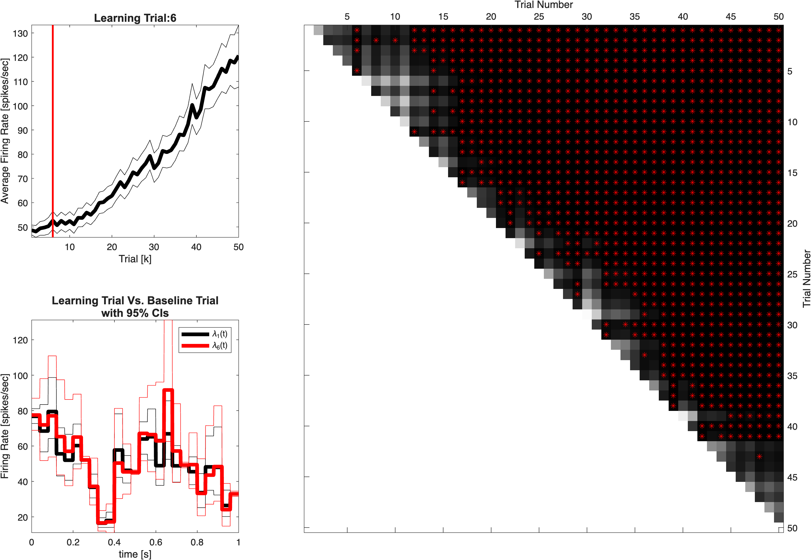
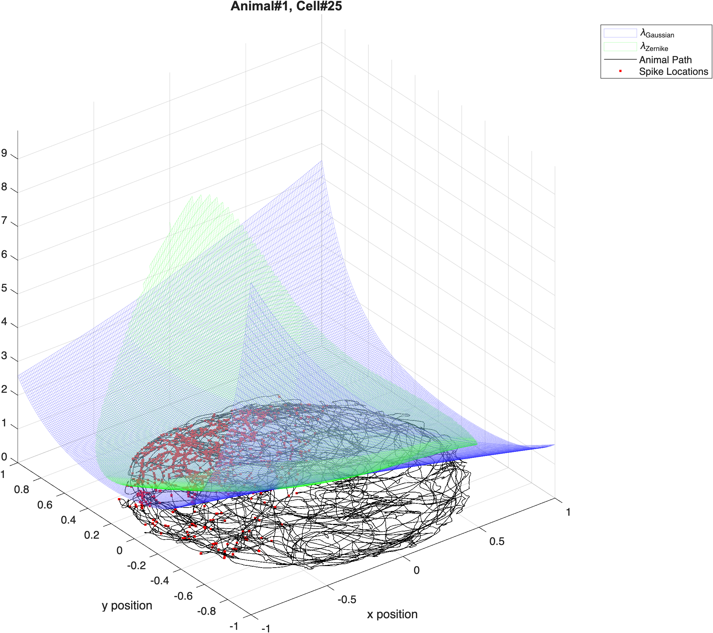
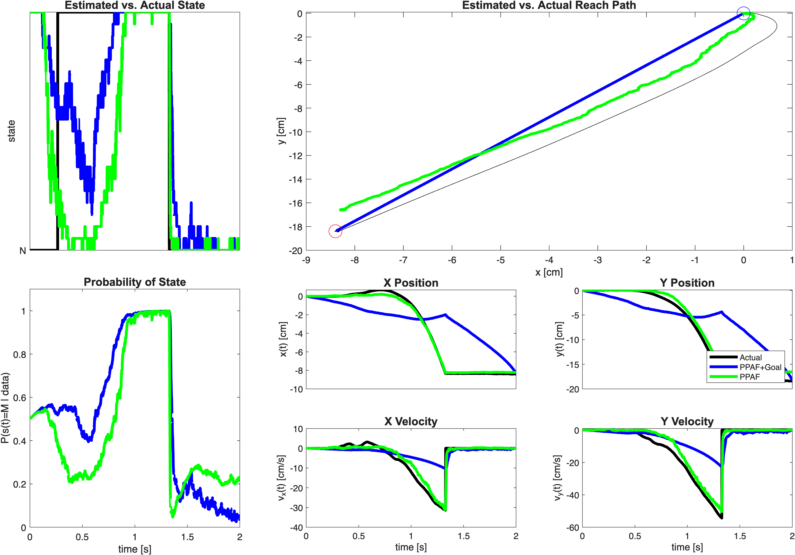

# nSTAT Paper Examples

This page maps the standalone MATLAB paper examples to the canonical source
files and generated outputs in this repository.

Canonical source files:
- `helpfiles/nSTATPaperExamples.mlx`
- `helpfiles/nSTATPaperExamples.m`

Paper reference:
- Cajigas I, Malik WQ, Brown EN. *nSTAT: Open-source neural spike train
  analysis toolbox for Matlab.* Journal of Neuroscience Methods 211:245-264
  (2012). DOI: [10.1016/j.jneumeth.2012.08.009](https://doi.org/10.1016/j.jneumeth.2012.08.009)
- Public article page (captions/section text used for mapping):
  [PMC3491120](https://pmc.ncbi.nlm.nih.gov/articles/PMC3491120/)

## Run Everything

From a fresh clone (MATLAB R2025b):

```matlab
cd('/path/to/nSTAT')
addpath(genpath(pwd));
nSTAT_Install('DownloadExampleData',true);
build_paper_examples;
```

Outputs:
- Figures: `docs/figures/example01/` ... `docs/figures/example05/`
- Manifest: `docs/figures/manifest.json`

## Data and Reproducibility Policy

- RNG is fixed with `rng(0,'twister')` in each standalone example.
- Figures are exported with fixed dimensions and DPI via
  `nstat.docs.exportFigure`.
- The paper-example dataset is not versioned in Git.
- `nSTAT_Install` can prompt to download the figshare archive into `data/`.
- Noninteractive install:

```matlab
nSTAT_Install('DownloadExampleData',true)
```

- Dataset DOI: [10.6084/m9.figshare.4834640.v3](https://doi.org/10.6084/m9.figshare.4834640.v3)
- Paper DOI: [10.1016/j.jneumeth.2012.08.009](https://doi.org/10.1016/j.jneumeth.2012.08.009)
- No publication PDF images are copied into this repository.

## Example Index

| ID | Standalone source | Primary paper mapping | Figure gallery |
|---|---|---|---|
| `example01` | [examples/paper/example01_mepsc_poisson.m](../examples/paper/example01_mepsc_poisson.m) | Section 2.3.1; mEPSC analyses (related to Figs. 3 and 10) | [docs/figures/example01](./figures/example01/) |
| `example02` | [examples/paper/example02_whisker_stimulus_thalamus.m](../examples/paper/example02_whisker_stimulus_thalamus.m) | Section 2.3.2; explicit stimulus + history effects (related to Figs. 4 and 11) | [docs/figures/example02](./figures/example02/) |
| `example03` | [examples/paper/example03_psth_and_ssglm.m](../examples/paper/example03_psth_and_ssglm.m) | Sections 2.3.3-2.3.4; PSTH and SSGLM (related to Figs. 5, 6, and 12) | [docs/figures/example03](./figures/example03/) |
| `example04` | [examples/paper/example04_place_cells_continuous_stimulus.m](../examples/paper/example04_place_cells_continuous_stimulus.m) | Section 2.3.5; place-cell receptive fields (related to Figs. 7 and 13) | [docs/figures/example04](./figures/example04/) |
| `example05` | [examples/paper/example05_decoding_ppaf_pphf.m](../examples/paper/example05_decoding_ppaf_pphf.m) | Sections 2.3.6-2.3.7; decoding with PPAF/PPHF (related to Figs. 8, 9, 14, plus canonical hybrid extension) | [docs/figures/example05](./figures/example05/) |

## Gallery

### Example 01: mEPSC Poisson Models

Question: does Mg2+ washout produce firing-rate dynamics beyond a constant
Poisson baseline?



### Example 02: Explicit Stimulus + History (Thalamus)

Question: what stimulus lag and history order best explain whisker-evoked
spike trains?



### Example 03: PSTH and SSGLM

Question: how do PSTH and state-space GLM differ in capturing trial
learning dynamics?



### Example 04: Place-Cell Receptive Fields

Question: how do Gaussian and Zernike basis models compare for place-field
mapping across cells and animals?



### Example 05: Decoding With PPAF and PPHF

Question: how accurately can neural populations decode stimulus/reach state
with adaptive and hybrid point-process filters?


